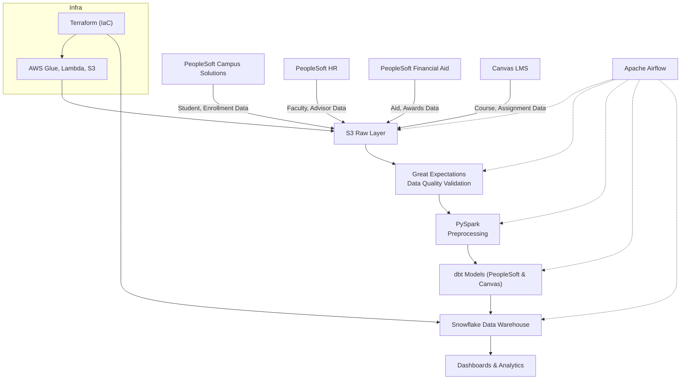

# Reusable Analytics Pipeline for Higher Education (PeopleSoft & Canvas LMS)

## 🎓 Overview
This project implements a modular, reusable ETL pipeline for Higher Education, specifically integrating data from:
- **PeopleSoft Campus Solutions** (student information)
- **PeopleSoft Human Resources** (faculty and staff data)
- **PeopleSoft Financial Aid** (student aid and awards)
- **Canvas LMS** (learning management system data)

The pipeline is built using a modern cloud-native stack and follows industry best practices for data engineering. All data models and transformations are tailored to these real-world systems, with example table names and flows matching PeopleSoft and Canvas LMS.

## 🧰 Tech Stack
- **Data Sources**: PeopleSoft Campus Solutions, PeopleSoft HR, PeopleSoft Financial Aid, Canvas LMS
- **Data Processing**: AWS Glue, Lambda, S3
- **Data Warehouse**: Snowflake
- **Data Transformation**: PySpark, dbt (with models for PeopleSoft and Canvas)
- **Orchestration**: Apache Airflow
- **Data Quality**: Great Expectations
- **Infrastructure**: Terraform (IaC)

## 📊 Use Cases
The pipeline processes and unifies student lifecycle data from multiple campuses and systems to power various KPIs:
- Student retention and graduation rates (from PeopleSoft Campus Solutions)
- Course fill rates and dropout patterns (from Canvas LMS and PeopleSoft)
- Faculty load analysis (from PeopleSoft HR)
- Financial aid impact assessment (from PeopleSoft Financial Aid)
- Enrollment trends and predictions (across all systems)

## 🎯 Key Features
- Modular and reusable pipeline components
- Automated data quality checks
- Infrastructure as Code (IaC)
- Data lineage tracking
- Real-time monitoring and alerting
- Scalable architecture

## 📁 Project Structure
```
├── dags/                  # Airflow DAGs for workflow orchestration
├── dbt/                   # dbt models for data transformation
├── sql/                   # Raw Snowflake transformation queries
├── spark_jobs/           # PySpark preprocessing scripts
├── great_expectations/   # Data validation and quality checks
├── terraform/            # Infrastructure as Code scripts
├── mock_data/            # Sample data for testing
└── docs/                 # Architecture and process documentation
```

## 🚀 Getting Started

### Prerequisites
- Python 3.8+
- AWS CLI configured
- Snowflake account
- Terraform installed
- Docker (for local development)

### Setup Instructions
1. Clone the repository
```bash
git clone https://github.com/yourusername/reusable-analytics-pipeline.git
cd reusable-analytics-pipeline
```

2. Install dependencies
```bash
pip install -r requirements.txt
```

3. Configure AWS credentials
```bash
aws configure
```

4. Initialize Terraform
```bash
cd terraform
terraform init
terraform plan
terraform apply
```

5. Set up Snowflake
```bash
cd sql
snowsql -f setup.sql
```

## 🏗️ Architecture
The pipeline follows a modern data architecture:

1. **Data extraction from source systems**: Python scripts connect to PeopleSoft (Oracle DB) and Canvas LMS (REST API)
2. **Raw data storage in S3**: Extracted CSVs are uploaded to S3 using a Python utility
3. **Data quality validation using Great Expectations**
4. **Transformation using PySpark and dbt** (with models for PeopleSoft and Canvas)
5. **Loading into Snowflake data warehouse**
6. **Orchestration using Airflow**



## 🚀 ETL Flow (Step-by-Step)
1. **Extract PeopleSoft data**: Run `extract_peoplesoft.py` to pull data from Oracle DB and save as CSV
2. **Extract Canvas LMS data**: Run `extract_canvas.py` to pull data from Canvas API and save as CSV
3. **Upload to S3**: Run `upload_to_s3.py` to upload all CSVs in `mock_data/` to S3 raw layer
4. **Validate data quality**: Run Great Expectations suite on S3 data
5. **Preprocess with PySpark**: Run PySpark jobs to clean and join data
6. **Transform with dbt**: Run dbt models for PeopleSoft and Canvas
7. **Load to Snowflake**: Data lands in Snowflake for analytics
8. **Orchestrate with Airflow**: Airflow DAG automates the entire pipeline

## 🛠️ Scripts
- `extract_peoplesoft.py`: Extracts data from PeopleSoft (Oracle DB)
- `extract_canvas.py`: Extracts data from Canvas LMS (REST API)
- `upload_to_s3.py`: Uploads extracted CSVs to S3
- (More scripts for validation, transformation, and loading to follow)

## 🧪 Testing
```bash
# Run data quality tests
python -m pytest tests/

# Run Great Expectations validation
great_expectations checkpoint run
```

## 📊 Results
- Successfully unified 10 years of academic, HR, financial aid, and LMS data from PeopleSoft and Canvas
- Enabled real-time dashboards and predictive models
- Reduced reporting delays by 80%
- Improved data quality and consistency


## 👥 Authors
- Dilliraja Sundar

## 🙏 Acknowledgments
- Thanks to all contributors and supporters
- Inspired by modern data engineering practices

## 📚 Example Data Flow
1. **PeopleSoft & Canvas data** are ingested and stored in S3 (raw layer)
2. **Great Expectations** validates data quality (e.g., student IDs, course codes)
3. **PySpark** performs preprocessing and cleaning
4. **dbt** models transform and join data from PeopleSoft and Canvas (see `dbt/models/staging/` and `dbt/models/marts/`)
5. **Snowflake** serves as the analytics warehouse
6. **Airflow** orchestrates the entire workflow

## 📝 Note
All dbt models and pipeline logic reference real-world PeopleSoft and Canvas LMS tables and fields. See the `dbt/models/staging/` directory for examples like `stg_ps_campus_solutions.sql`, `stg_ps_hr.sql`, `stg_ps_financial_aid.sql`, and `stg_canvas_lms.sql`.

---

This project is a practical demonstration of how to build a production-grade analytics pipeline for Higher Education using PeopleSoft and Canvas LMS as source systems. It is designed for extensibility and can be adapted to other institutions using similar systems.
